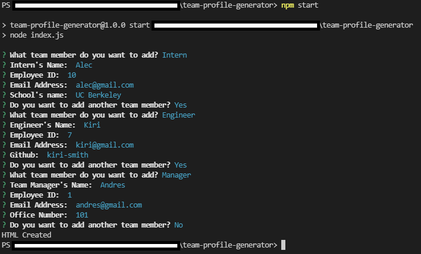
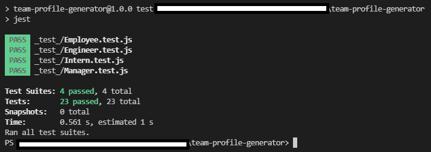

# Team Profile Generator

## Description

Generate your Team Profile Website by using only your terminal!. Answer all the given questions and your HTML File will be generated without even coding!

## Prompt Picture

## Test Picture

## Getting Started

These instructions will get you a copy of the project up and running on your local machine for development and testing purposes.

* Click on the green button named Code on github and copy the URL of the repository.
* Use the command git clone (repository's URL) to clone all existing project on your local machine.
* Start your testing opening your terminal or command line and going to the repository location on your machine.
* Type the commands "npm install inquirer", "npm install fs" & "npm install jest" to get the libraries used in this project.
* Type the command "npm start" to start generating your HTML file.
* Fill out all the questions about your team.
* After answering all the questions your HTML file will be generated with all the answers you've given.
* Congratulations! You just generated your own Team Profile Website with only a few and simple steps and with no coding.

## Walkthrough Video

* [Link To Video](https://watch.screencastify.com/v/faibh3KIX91Uv0hdXc5l)

## Prerequisites

* Git
* Node.js
* NPM
* Inquirer
* fs
* Jest

## Installing

* Fork the project to get your own copy of the repository.
* Clone the repository.
* Follow the steps above to generate your own Team Profile Website.

## Built With

* [Javascript](https://developer.mozilla.org/en-US/docs/Web/javascript)
* [Node.js](https://nodejs.org/en/)
* [NPM](https://docs.npmjs.com/)
* [Inquirer](https://www.npmjs.com/package/inquirer)
* [FS](https://nodejs.org/api/fs.html)
* [Jest](https://www.npmjs.com/package/jest)

## Link of Repository

* [See Repository](https://github.com/andresliu22/team-profile-generator)

## Authors

* **Andres Liu** 

## Contacts

- [Link to Portfolio Site](https://andresliu22.github.io/portfolio/)
- [Link to Github](https://github.com/andresliu22/)
- [Link to LinkedIn](https://www.linkedin.com/in/andresliu22/)

## License

This project is licensed under the ISC License.

## Acknowledgments

* Always do some research to get the best possible way to code anything.
* Make the website and code easy to read for viewers and other developers by using brief comments.
* Be use to commit to get an insight of what you have done for each progress you make.

